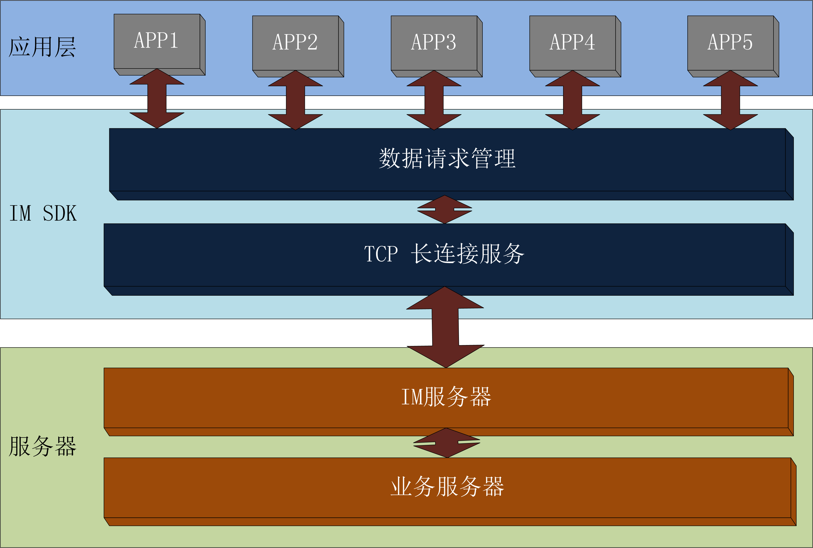
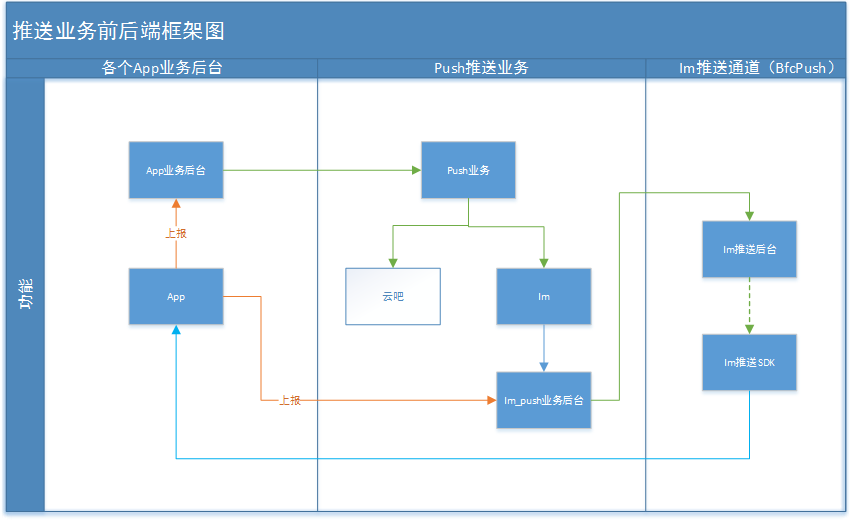

# 关于推送库
推送库，用于常用的消息推送，接收服务器的推送过来的信息，与第3方推送类似

# 关于推送说明

## 现阶段推送有四种方案

+ 1、老版本BFC的Push-Pad版，既集成在“平板”上的BFCPush.apk，支持实时推送，成本原因，新机型已经去掉了该apk，老机型逐步使用im替换方案；
+ 2、老版本BFC的Push-phone版，既集成在“手机”上的BFCPush.apk,仅机器充电时支持推送(其中C2手机电信2G网络也关闭推送)，其余时间推送服务关闭，无法收到消息。该版本原则上不再升级维护；
+ 3、新版本im的bfc-push,既新BFC推出的推送库，采用maven仓库依赖的方式集成到自己应用的apk中，如果你的应用仅在我们自家机器上使用请选择这个（其中电信2G网络下推送关闭，其余都打开）；
+ 4、新版本im的bfc-push-common,既新BFC推出的推送库，采用maven仓库依赖的方式集成到自己应用的apk中，通配海内外所有机器，如果需要出海请选择这个（其中电信2G网络下推送关闭，其余都打开）；

<h4>推送方案</h4>
<table>
	<tr>
		<td><b>方案/机型</b></td>
		<td><b>BBK平板</b></td>
		<td><b>Imoo手机</b></td>
		<td><b>海外机器</b></td>
	</tr>
	<tr>
		<td>Push-pad版（老）</td>
		<td> √ </td>
		<td> × </td>
		<td> × </td>
	</tr>
	<tr>
    	<td>Push-phone版（老）</td>
    	<td> × </td>
    	<td>充电时支持</td>
    	<td> × </td>
    </tr>
    <tr>
        <td>bfc-push版（新im）</td>
        <td> √ </td>
        <td> √ </td>
        <td> × </td>
    </tr>
    <tr>
        <td>bfc-push-common版（新im）</td>
        <td> √ </td>
        <td> √ </td>
        <td> √ </td>
    </tr>
</table>

## 升级清单文档

+ 文档名称：UPDATE.md(http://172.28.2.93/bfc/BfcPush/blob/develop/UPDATE.md)

## 特性

保持长连接，共用一个长连接，旨在解决实时性、高效推送

## 业务框架

## 版本和项目名称
- 库版本： 3.0.0
- 项目英文名： BfcPush
- API支持： > 15

## 功用（功能列表）
- 提供初始化接口，简化使用
- 提供推送是否接收开关，控制推送接收
- 提供debug开关，方便log信息查看
- 提供别名标签设置接口，方便推送定位
- 提供主动拉取功能，及时获取推送信息
- 提供版本控件功能，方便推送SDK版本信息获取

## Demo效果图
- Demo获取地址：http://172.28.2.93/bfc/BfcPush.git

# 使用

> 特别提醒：`业务app如果有接入im,软件发布时要在OA上的发布单要求互联网技术部审核，描述：接入im推送，审核：杨一中 ！！！`

## 接入说明

### 接入评审
业务app接入提供接入的场景需求说明，im推送sdk开发人员组织评审，评审代表由im推送sdk开发人员、业务app开发人员、im业务后台开发人员、im服务器开发和运维人员组成。若有问题再扩大相关人员。

### APP KEY 和 APP TAG 申请流程

发送应用app的中文名、英文名、包名、应用简介描述发送到推送库负责人代为申请；

### 应用上报
接入推送需要业务app调用业务后台上报接口。

+ 接口地址如下：

测试地址：http://test.eebbk.net/im_push/banneradmin/home

正式地址：http://push.eebbk.net/im_push/banneradmin/home

+ 上报信息如下：

key:data

value：[DeviceInfoPojo.java](http://172.28.2.93/bfc/BfcPush/blob/develop/BfcPushDemo/src/main/java/com/eebbk/bfc/demo/push/report/DeviceInfoPojo.java) （转Json即可）

上报方案参考Demo中[BfcPushDemo](http://172.28.2.93/bfc/BfcPush/tree/develop-zjf/BfcPushDemo/src/main/java/com/eebbk/bfc/demo/push/report)中BfcReport.reportToAppImPush方法；

+ 如果上报数据需要加密请联系后台处理

+ 后台接口地址：[综合管理平台](http://system.eebbk.net/adminUser/judgeLogin) -> API管理系统 -> IM推送接口 -> 应用app上报注册信息

### 应用在Im后台推送消息验证推送是否集成正确方法

+ 应用app推送消息（测试环境）：[IM推送管理后台](http://test.eebbk.net/im_push/banneradmin/home) -> IM推手管理后台 -> 推送列表 -> 新增消息 -> 输入别名（默认为机器序列号）、应用名（申请KEY时的英文名）、正文，选择是否推离线 -> 点击发送按钮
+ 应用app推送消息（正式环境）：[综合管理平台](http://system.eebbk.net/adminUser/judgeLogin) -> IM推送系统 -> 推送列表 -> 新增消息 -> 输入别名（默认为机器序列号）、应用名（申请KEY时的英文名）、正文，选择是否推离线 -> 点击发送按钮

> 特别提醒：`此后台可以绕过业务后台直接给应用推送消息，谨慎推送，严禁群推消息，否则后果自负！！！`

## 注意事项
- 必须在推送管理平台上注册才可以使用
- AndroidManifest中需按规定配置好
- 推送广播接收者要继承PushReceiver，默认在包名进程里注册接收；
- 必须使用Maven仓库

## 前置条件

### 在项目中引用

#### 内部机型（步步高平板、imoo手机）

-  使用[网络配置](http://172.28.2.93/bfc/Bfc/blob/develop/public-config/%E4%BE%9D%E8%B5%96%E4%BD%BF%E7%94%A8%E8%AF%B4%E6%98%8E.md),  添加`compile bfcBuildConfig.deps.'bfc-push'`

#### 通用平台应用

-  使用[网络配置](http://172.28.2.93/bfc/Bfc/blob/develop/public-config/%E4%BE%9D%E8%B5%96%E4%BD%BF%E7%94%A8%E8%AF%B4%E6%98%8E.md),  添加`compile bfcBuildConfig.deps.'bfc-push-common'`

> 如果项目中的依赖与SDK中的依赖冲突，需要排除，例如：

	compile bfcBuildConfig.deps.'bfc-push'{
		 exclude module: 'bfc-sequencetools-json', module: 'support-annotations'
	}

### 权限申请
	<!-- 读写sdcard权限 需要动态申请 -->
	<uses-permission android:name="android.permission.WRITE_EXTERNAL_STORAGE" />
    <uses-permission android:name="android.permission.READ_EXTERNAL_STORAGE" />

	<!-- 读电话权限 需要动态申请 -->
	<uses-permission android:name="android.permission.READ_PHONE_STATE" />

	<!-- 普通权限 aar调用不用管 -->
    <uses-permission android:name="android.permission.CHANGE_NETWORK_STATE" />
    <uses-permission android:name="android.permission.CHANGE_WIFI_STATE" />
    <uses-permission android:name="android.permission.INTERNET" />
    <uses-permission android:name="android.permission.ACCESS_NETWORK_STATE" />
    <uses-permission android:name="android.permission.ACCESS_WIFI_STATE" />
    
	<uses-permission android:name="android.permission.WAKE_LOCK"/>
	<uses-permission android:name="android.permission.VIBRATE"/>
    <uses-permission android:name="android.permission.RECEIVE_BOOT_COMPLETED" />
    
    <uses-permission android:name="android.permission.WRITE_SETTINGS" />
    <uses-permission android:name="android.permission.GET_TASKS" />
    <uses-permission android:name="android.permission.REQUEST_IGNORE_BATTERY_OPTIMIZATIONS" />

	<uses-permission android:name="android.permission.RECEIVE_USER_PRESENT" />
    
  
### APPKey配置（AndroidManifest中配置）
#### 内部机型

	<meta-data
         android:name="SYNC_APP_KEY"
         android:value="开发人员统一分配的IM key" />
    <meta-data
         android:name="SYNC_RID_TAG"
         android:value="开发人员统一分配的IM tag" />  

#### 通用平台应用
	<meta-data
         android:name="SYNC_APP_KEY"
         android:value="开发人员统一分配的IM key" />
    <meta-data
         android:name="SYNC_RID_TAG"
         android:value="开发人员统一分配的IM tag" /> 

	<meta-data
        android:name="MI_APP_KEY"
        android:value="MI:开发人员统一分配的小米 key" />
    <meta-data
        android:name="MI_APP_ID"
        android:value="MI:开发人员统一分配的小米 id" />
	
> key、tag参数找相关开发人员统一申请

### 添加私有maven配置

project build.gradle

    allprojects {
        repositories {
            jcenter()
            // 增加私有Maven正式发布仓库
            maven { url bfcBuildConfig.MAVEN_URL }
            //灰度仓库地址
            maven { url bfcBuildConfig.MAVEN_RC_URL }
        }
    }

### 构建信息
    compileSdkVersion 23
    buildToolsVersion "24.0.0"
    minSdkVersion 15
    targetSdkVersion 24
  
## 全局配置说明

- AndroidManifest模板

	    <?xml version="1.0" encoding="utf-8"?>
		<manifest xmlns:android="http://schemas.android.com/apk/res/android"
	    	package="您的应用包名">
            
            <!-- bfc-push-common 需要配置小米的权限，内部机型不用配置这部分 -->
	        <permission android:name="您的应用包名.permission.MIPUSH_RECEIVE"
                android:protectionLevel="signature" />
            <uses-permission android:name="您的应用包名.permission.MIPUSH_RECEIVE" /> 

		    <application
		        android:name="Application名称"
		        android:allowBackup="false"
		        android:icon="@mipmap/ic_launcher"
		        android:label="应用名"
		        android:supportsRtl="true"
		        android:theme="@style/AppTheme">
		        <activity
		            android:name=".MainActivity"
		            android:screenOrientation="portrait">
		            <intent-filter>
		                <action android:name="android.intent.action.MAIN" />
		
		                <category android:name="android.intent.category.LAUNCHER" />
		            </intent-filter>
		        </activity>

				<receiver
		            android:name="推送消息接收者"
		            android:exported="false">
		            <intent-filter>
		                <action android:name="com.eebbk.bfc.im.sync_response" />
		
		                <category android:name="您的应用包名" />
		            </intent-filter>
		        </receiver>

		        <meta-data
         			android:name="SYNC_APP_KEY"
         			android:value="开发人员统一分配的IM key" />
    			<meta-data
         			android:name="SYNC_RID_TAG"
         			android:value="开发人员统一分配的IM tag" /> 

				<!--这部分只是通用平台的用户配置，内部机型不用配置这部分-->
				<meta-data
        			android:name="MI_APP_KEY"
        			android:value="MI:开发人员统一分配的小米 key" />
    			<meta-data
        			android:name="MI_APP_ID"
        			android:value="MI:开发人员统一分配的小米 id" />

		    </application>
		</manifest>

- 推送消息接收者

		
		
		public class 推送消息接收者名称 extends PushReceiver {

		    @Override
		    protected void onMessage(Context context, SyncMessage syncMessage) {
		        if (syncMessage != null) {
		            //推送平台接收到的是byte类型，转为String类型方法如下
                    byte[] temp=syncMessage.getMsg();
                    String msg=new String(temp);
                    Log.i("IM_PUS_MSG"," >>>>> msg = "+msg)
		        } 
		    }
		}

- Application中的初始化

		//注意：必须要在Application里进行初始化	
		public class 你的自定义application名称 extends Application {
		
		    @Override
		    public void onCreate() {
		        super.onCreate();
		
		        //默认初始化设置,实际应用时最好在这里初始化
		        BfcPush bfcPush= new BfcPush.Builder()
		                            .setDebug(true)// 默认为false,关闭Log打印 
		                            .setUrlMode(BfcPush.Settings.URL_MODE_TEST)//默认为URL_MODE_RELEASE,正式环境Url地址
		                            .build();
		                            
		        bfcPush.init(this, new OnInitSateListener() {
		            @Override
		            public void onSuccess() {
		                //to do something
		            }
		
		            @Override
		            public void onFail(String errorMsg, String errorCode) {
		                //to do something
		            }
		        });
		    }
		}
  
如果需要监听推送状态,请使用下面初始化方式：

		//注意：必须要在Application里进行初始化	
		public class 你的自定义application名称 extends Application {
		
		    @Override
		    public void onCreate() {
		        super.onCreate();
		
		        //默认初始化设置,实际应用时最好在这里初始化
		        BfcPush bfcPush= new BfcPush.Builder()
		                            .setDebug(true)// 默认为false,关闭Log打印 
		                            .setUrlMode(BfcPush.Settings.URL_MODE_TEST)//默认为URL_MODE_RELEASE,正式环境Url地址
		                            .build();
		                            
		        bfcPush.init(this, new OnInitSateListener() {
		            @Override
		            public void onSuccess() {
		                //to do something
		            }
		
		            @Override
		            public void onFail(String errorMsg, String errorCode) {
		                //to do something
		            }
		        }, new OnPushStatusListener() {
                     @Override
                     public void onPushStatus(int status, Object... values) {
                        Log.i(TAG, "status:" + status);
                        switch (status){
                            case Status.RECEIVE:
                                // 收到推送消息
                                SyncMessage syncMessage = (SyncMessage)values[0];
                                LogUtils.i("BasicFunctionActivity", "onPushStatus syncMessage:" + syncMessage.toString());
                                break;
                            case Status.LOG:
                                // 推送库关键日志打印信息
                                LogInfo logInfo = (LogInfo)values[0];
                                LogUtils.i("BasicFunctionActivity", "onPushStatus logInfo:" + logInfo.toString());
                                break;
                            case Status.ERROR:
                                // 异常
                                String errorCode = String.valueOf(values[0]);
                                break;
                            case Status.CONNECTED:
                                // IM连接成功
                                break;
                            case Status.DISCONNECTED:
                                // IM连接断开
                                break;
                            default:
                                break;
                }
                     }
                 });
		    }
		}

##### OnPushStatusListener的onPushStatus回调status说明：

- OnPushStatusListener.Status.RECEIVE           
    - 接收到推送消息状态回调
    - values[0]: SyncMessage

## 公开接口说明

#### 公共接口类：BfcPush

3.1.1-bugfix版本新增BfcPush接口类通过Builder模式构造，方便App接入初始化前进行必要的参数配置，兼容老的EebbkPush接口类，建议替换为新的BfcPush接口类。

#### 接口1：初始化接口

 - 名称：init(@NonNull Context context, OnInitSateListener onInitSateListener)
 - 作用说明：用于与服务器建立连接的，及一些参数初始化操作
 - 参数说明：
 
 		1. context（上下文对象）：（不能为空，为空直接抛出运行时异常）；
 		2. onInitSateListener（初始化回调，不用设为null）
 			初始化成功（onSuccess()）；
			初始化失败（onFail(String errorMsg)），返回失败信息。
 	
 - 使用方式：
 
 
 	    bfcPush.init(getApplicationContext(), new OnInitSateListener() {
            @Override
            public void onSuccess() {
                //to do something
            }

            @Override
            public void onFail(String errorMsg, String errorCode) {
                //to do something
            }
        });
>建议在Application中的onCreate方法中掉用

#### 接口2：设置标签接口
 - 名称：setTags(List<String> tags,OnAliasAndTagsListener onAliasAndTagsListener)
 - 作用说明：用于设置标签
 - 参数说明：
 
 		1. tags（别名，不用设为null）：只能以数字字母下划线组成，字符长度小于40的字符串集合，可以为空，为空传null，不合规范会直接抛出运行时异常,不区分大小写；
 		2. onAliasAndTagsListener：设置成功失败监听（不用，设null）
			成功：onSuccess(String alias, List<String> tags)；返回别名标签
			失败：onFail(String alias, List<String> tags,String errorMsg)；返回别名标签，及错误信息
 	
 - 使用方式：
 
 
	    bfcPush.setTags(tagsList, new OnAliasAndTagsListener() {
	          @Override
	          public void onSuccess(String alias, List<String> tags) {
	             //to do something
	          }
	
	         @Override
	         public void onFail(String alias, List<String> tags, String errorMsg, String errorCode) {
	             //to do something
	         }
	    });

#### 接口3：停止推送接口
 - 名称：stopPush(OnResultListener onResultListener)
 - 作用说明：用于停止当前应用接收推送消息,实际只是将别名设空,仅自己应用不接收推送消息，并没有停止推送服务
 - 参数说明：
 
 		onResultListener：设置成功失败监听（不用，设null）
			成功：onSuccess()；
			失败：onFail(String errorMsg)；返回错误信息。
 	
 - 使用方式：
 
 
	    bfcPush.stopPush(new OnResultListener() {
             @Override
              public void onSuccess() {
                   //to do something
              }

              @Override
              public void onFail(String errorMsg,String errorCode) {
                  //to do something
              }
        });

#### 接口4：开启推送接口
 - 名称：resumePush(OnResultListener onResultListener)
 - 作用说明：用于开启当前应用接收推送消息
 - 参数说明：
 
 		onResultListener：设置成功失败监听（不用，设null）
			成功：onSuccess()；
			失败：onFail(String errorMsg)；返回错误信息。
 	
 - 使用方式：
 
 
	    bfcPush.resumePush(new OnResultListener() {
             @Override
              public void onSuccess() {
                   //to do something
              }

              @Override
              public void onFail(String errorMsg,String errorCode) {
                  //to do something
              }
        });

#### 接口5：是否开启推送接口
 - 名称：isStopPush()
 - 作用说明：当前应用接收推送是否开启
 - 返回值说明：
 
		false：没有停止，推送为开启接收状态（默认为false）
		true：停止推送，推送为关闭接收状态，不接收推送信息
 	
 - 使用方式：
 
 
	    boolean mIsStopPush = bfcPush.isStopPush();

#### 接口6：主动拉取接口
 - 名称：sendPushSyncTrigger(OnResultListener onResultListener)
 - 作用说明：用于主动查询服务器上是否有未接收的推送消息，有服务器则会把消息推送下来，没有结束
 - 参数说明：
 
		onResultListener：拉取成功失败监听（不用，设null）
			成功：onSuccess()；
			失败：onFail(String errorMsg)；返回错误信息。
 	
 - 使用方式：
 
 
	   	bfcPush.sendPushSyncTrigger(new OnResultListener() {
             @Override
             public void onSuccess() {
                  //to do something
             }

             @Override
             public void onFail(String errorMsg, String errorCode) {
                  //to do something
             }
        });

#### 接口7：获取SDK版本信息接口
 - 名称：SDKVersion
 - 作用说明：用于获取SDK版本信息
 	
 - 使用方式：
 
 
		   Int code=SDKVersion.getSDKInt(); 
	       String versionName=SDKVersion.getVersionName(); 
	       String buildName=SDKVersion.getBuildName(); 
	       String buildTime=SDKVersion.getBuildTime(); 
	       String buildTag=SDKVersion.getBuildTag(); 
	       String buildHead=SDKVersion.getBuildHead();

## 兼容性处理说明

旧的推送替换新的推送需要配合业务后台进行一些上报操作，而这些需要上层的业务App来处理。

+ 上报信息到im_push业务中转后台

上报方案参考Demo中[BfcPushDemo](http://172.28.2.93/bfc/BfcPush/tree/develop-zjf/BfcPushDemo/src/main/java/com/eebbk/bfc/demo/push/report)中BfcReport.reportToAppImPush方法；

+ 上报信息到各自App的业务后台

这里需要App和各自业务后台调试

## 异常处理说明

- 接口参数不合规范，及SDK通信处理是异常都会有相应的错误码，及呈现方式（log信息，抛异常，回调等）。
 
- 错误码说明

 * 04201001:  初始化上下文参数null异常
 * 04201002:  设置别名参数为空异常	
 * 04201003:  设置别名参数字符长度大于40异常
 * 04201004:  设置别名参数不为数字字母下划线组成异	
 * 04201005:  设置标签参数字符长度大于40异常	
 * 04201006:  设置标签参数不为数字字母下划线组成异常
 * 04201007:  预埋IP常数异常
 * 04201008:  心跳策略常数设置异常
 * 04201009:  非法机器序列号“0123456789ABCDEF”
	
 * 04202001:  当前前进程不存在异常	
 * 04202002:  多进程初始化异常
	
 * 04203001:  等待初始化异常	

 * 04204001:  push application 没有初始化异常	
 * 04204002:  getPushApplicationSafely 没有设置回调异常
 * 04204003:  初始化失败，sdcard空间不足
	
 * 04205001:  响应错误异常	
 * 04205002:  请求空异常	
 * 04205003:  响应空异常
 * 04205004:  别名重复
 * 04205005:  别名设置失败
	
 * 04301001:  TCP连接断开异常	
 * 04302001:  接收数据为null异常		

## 特殊情况
说明在一些极端情况下遇到或可能遇到的问题以及对问题的解决方案，亦或者不予解决的理由

#### 特殊情况1：
- 现象：网络不好的情况可能导致初始一段时间内，出现推送延时的情况，最长延时5分钟
- 原因：长连接的维持需要定时发送心跳包，心跳时间是动态确定，期间会有连接断开，导致推送延时

#### 特殊情况2：
- 现象：后台推送测试显示成功，应用连接，网络一切正常，但收不到数据
- 原因：可能是推送后台转发问题
- 解决方式：找推送后台相关人员查看推送记录，找出原因解决

## 关于推送库正式环境和测试环境之间的切换的问题说明

+ 推送服务共用机制说明

    + 一台机器上只会存在一个推送服务，这个推送服务是一个单独的进程：eebbk.push；//3.1.5之前为sync.push
    + 该推送服务可以寄生在任何一个集成了推送库的App下。
    + 我们可以通过文件根目录下.push文件夹下的value.txt文件,，该文件保存了宿主App的包名。

+ 环境配置接口（初始化init（）方法前配置）

    + 旧接口：EebbkPush.setUrlDebugMode(boolean isUrlDebug); // true:测试环境 ，false:正式环境（默认）；
    + 新接口：BfcPush.Builder().setUrlMode(BfcPush.Settings.URL_MODE_TEST)// URL_MODE_TEST：测试环境，URL_MODE_RELEASE,正式环境（默认）。【3.1.1-bugfix以上版本新增，兼容旧接口，建议使用新接口配置】
    + 调用对应的接口，请使用对应的初始化init接口初始化。
    
+ 环境切换步骤
    
    + 自己的业务后台，以及im_push后台，都切换到对应的环境；
    + 切换对应的AppKey；
    + 调用上述环境配置接口，设置对应的环境配置；
    + 清除App数据，这是为了清除保存在本地的注册信息，如别名，秘钥等，不同的环境不一样，但是初始化时检测到本地有数据就不再重新注册；
    + 删除根目录下.push文件夹下的value.txt文件，该文件保存了宿主App的包名。由于推送为共享一个推送服务的，如果宿主App的推送服务的环境和自己要求的环境不一致，导致推送无法正常接收消息。这么做的目的初始化时启动的推送服务寄生在自己本身App，方便单独测试。可能别的App这时绑定到自己无法正常接收，但并不影响自己的测试。

+ 切换约定

    + 发布出去给用户的App必须切换到正式环境;
    + 集成到系统版本的App必须切换到正式环境;
    + `若没有遵守上述两点，不仅可能导致自己的App无法正常接收消息，还可能导致整机其他App无法正常接收消息！！！`

## Q&A

- Q: 同样的apk，有的机器能够收到信息，有的不能收到，提示 alias does not exist 是为什么？
- A: 可能存在的原因 1、是否正确上报；2、网络是否正常；3、是否切换了正式与测试环境；排除相关问题后若无法解决，请发送机器序列号、应用名称与负责人沟通。

- Q: 为什么测试环境和正式环境之间切换必须要清除数据？
- A: 推送的别名等信息一旦注册成功别名等注册信息就保存到本地，下次启动的时候就判断本地是否有注册信息，如果有就不再注册，所以你的机器注册了正式环境的信息，切换到测试环境 实际没有启动注册过程。

## 收不到消息N个原因

+ 1、测试与正式环境错乱，群发收不到
    + 现象：在后台群发消息，弹出发送失败
    + 原因：应用有部分注册了测试环境，有部分注册了正式环境，后台查找数据异常，具体@后台

+ 2、别名未注册
    + 现象：在后台单发消息，弹框提示别名未注册
    + 原因：应用没有注册或者关闭推送，可以去im后台查看机器登录在线情况
    + 解决：查找别名未注册的原因

+ 3、离线消息过多
    + 现象：一发送消息就会收到10条以前的，而现在的收不到
    + 原因：这台机器的在服务器有太多的离线消息没有接收，消息要按照队列发送
    + 解决：目前没有好的方案，后台要这样排队一个一个发，如影响功能请联系开发人员

+ 4、测试环境4G网收不到
    + 现象：测试环境4G网收不到消息
    + 原因：测试环境需要内网才能接收消息
    + 解决：所以需要连接公司wifi

+ 5、切换测试环境或者正式环境后收不到消息
    + 现象：切换测试环境或者正式环境后收不到消息
    + 原因：推送初始化时会把注册信息保存到本地,切换环境后检测到本地有初始化信息就不再重新初始化，实际无法注册到相应的环境里边；
    + 解决：先卸载应用（或者清除应用数据）、然后重新安装

## 源码保存地址
http://172.28.2.93/bfc/BfcPush.git

## 相关文档获取方式
http://172.28.2.93/bfc/BfcPush.git
